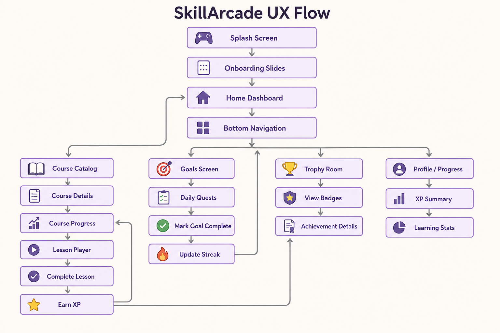

<p align="center">
  
</p>

<p align="center">
  <b>SkillArcade: Gamify Your Growth</b><br>
  <i>Turning the educational grind into a high-score quest.</i>
</p>

<p align="center">
  <a href="README.md">English</a> •
  <a href="docs/translations/README_ES.md">Español</a> •
  <a href="docs/translations/README_FR.md">Français</a>
</p>

<p align="center">
  
  
  
  
</p>

---

## 🕹️ Summary
SkillArcade is a mobile learning platform designed to bridge the gap between education and entertainment. Built with a **Neo-Boutique Arcade** aesthetic, it provides a highly interactive environment where users track progress through XP, unlock trophies, and complete goals via a localized, offline-first architecture.

> [!WARNING]
> This project is currently in a "Local-First" phase. Persistence is handled via Room, but no cloud sync is active. Your data stays on your device.

## 🎙️ Narrative
SkillArcade was born out of frustration with dry, uninspiring learning platforms. I wanted something that felt like playing a game—where every lesson is a quest and every goal achieved is a high score. Traditional LMS apps feel like homework; SkillArcade feels like a reward. It's about turning the cognitive load of learning into the dopamine hit of an arcade victory.

## 🛠️ Technical Stack

| Category | Technology | Version |
| :--- | :--- | :--- |
| **Language** | Kotlin | 2.2.10 |
| **UI Framework** | Jetpack Compose (BOM) | 2026.02.01 |
| **Dependency Injection** | Hilt | 2.59.2 |
| **Database** | Room | 2.8.4 |
| **Navigation** | Navigation Compose | 2.9.8 |
| **Image Loading** | Coil | 3.0.0-rc01 |
| **Architecture** | Clean Architecture / MVI-ish | - |

## 📐 Document Structure & Architecture
The project follows a strict separation of concerns to ensure efficiency and maintainability.

```text
+---------------------------------------+
|              UI Layer                 |
| (Compose Screens, ViewModels, Theme)  |
+-------------------+-------------------+
                    |
                    v
+-------------------+-------------------+
|            Domain Layer               |
|  (Models, UseCases, Repositories)     |
+-------------------+-------------------+
                    |
                    v
+-------------------+-------------------+
|              Data Layer               |
| (Room DB, DAOs, Repository Impl)      |
+---------------------------------------+
```

## 🚀 Setup Instructions
Follow these steps to deploy the arcade environment to your local machine:

1. **Clone the repository:**
   ```bash
   git clone https://github.com/user/SkillArcade.git
   ```
2. **Open in Android Studio:**
   Ensure you are using Android Studio Ladybug (or newer) to support AGP **9.2.0**.
3. **Sync Gradle:**
   Allow the IDE to download dependencies defined in `libs.versions.toml`.
4. **Run Build:**
   ```bash
   ./gradlew assembleDebug
   ```

## 🎮 Usage
The user remains in total control of their learning path. 

*   **Navigate** through the `Course Catalog` to find new quests.
*   **Track** progress in the `Home Dashboard`.
*   **Complete** goals to trigger the `GoalEvaluator` logic.
*   **Collect** trophies in the `Trophy Room`.

**Key Metrics:**
*   **100% Offline Capability**: All data resides in the local Room database.
*   **Zero Latency UI**: State management ensures immediate feedback for XP updates.
*   **Type-Safe Navigation**: Utilizing Kotlin Serialization for robust routing.

> [!NOTE]
> Efficiency is our priority. Composable functions are kept small and modular to ensure a **60 FPS** UI performance even on entry-level devices.

---
